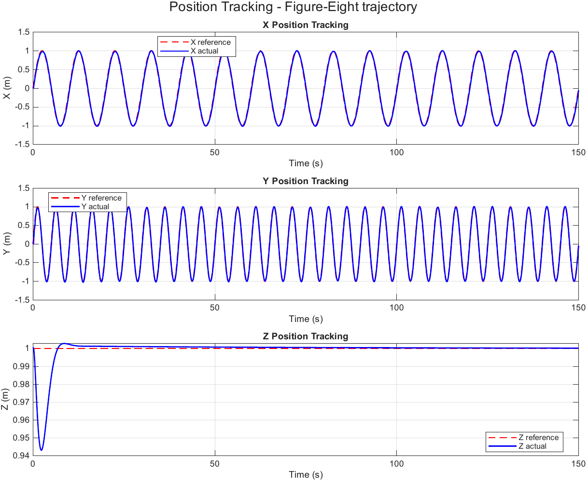
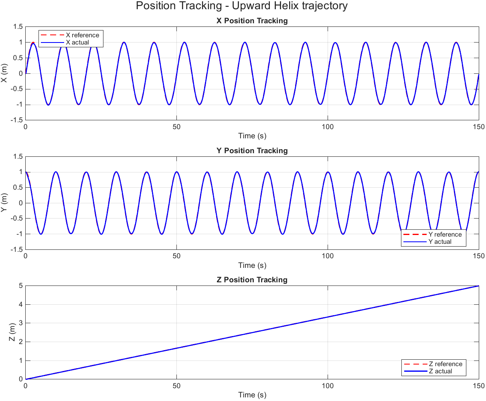

# GA-Tuned Model Predictive Control for Quadrotor Trajectory Tracking

MATLAB implementation of a linear MPC for quadrotor trajectory tracking, with all 20 controller weights tuned by a genetic algorithm against a composite tracking / effort / saturation fitness. Disturbance rejection is tested with torque disturbances injected directly into the rotational dynamics — the controller is never told about them and must reject them through feedback alone.

Part of a controller benchmark series (MPC · LQI · GA-LQI · GA-PID · NFSSMC) built on an identical plant, identical reference trajectories and identical disturbance profiles, so results are directly comparable across controllers.


*Figure-eight trajectory, 0.50 Nm peak torque disturbance (mode 4) — GA-tuned weights.*

## Controller

| | |
|---|---|
| Framework | MATLAB MPC Toolbox (`mpc`, `mpcmove`) at 100 Hz (`dt = 0.01 s`) |
| Prediction / control horizon | 12 / 4 (GA-tuned) |
| Decision variables tuned by GA | 20 — 4 MV weights, 4 MV-rate weights, 12 OV weights |
| Input constraints | Thrust ∈ [0, 25] N about hover; torques ∈ [−7, 7] Nm per axis |
| GA fitness | 3.0·RMSE_pos + 0.8·RMSE_att + 2.0·ITAE_pos + 0.5·ITAE_att + 2.0·SS_pos + 0.5·SS_att + 0.05·effort + 20·saturation penalty |

## Plant model

12-state quadrotor: `x = [x ẋ y ẏ z ż φ φ̇ θ θ̇ ψ ψ̇]`, inputs `U = [T τφ τθ τψ]`.

Mass 1.25 kg · Ixx = Iyy = 0.0232 kg·m² · Izz = 0.0468 kg·m². Linearized about hover with the nominal input set to hover thrust.

## Reference trajectories & disturbances

Five analytic trajectories selected by one flag (`slctr`): circular, upward helix, figure-eight, upward spiral, rose-petal. Four torque disturbance modes (`torqueDistMode`): none, 0.15, 0.30, 0.50 Nm peak — applied to roll/pitch/yaw dynamics only, invisible to the controller.

## Results in this repository

`results/` contains complete outputs for 3 trajectories × 2 disturbance levels (none / strong):

- `tuned_weights/` — GA-optimized weight vectors (`.mat`), loadable as seed weights
- `figure_packs/` — full 15-figure PDF pack per run: 3D tracking, per-axis errors, attitude, control inputs, saturation, disturbance history
- `reports/` — auto-generated Word performance reports (RMSE, ITAE, steady-state, run summary)



## Requirements

- MATLAB R2024a or newer (results generated on R2026a)
- MPC Toolbox
- Global Optimization Toolbox (only if `enableGATuning = true`)
- Parallel Computing Toolbox (optional, speeds up GA)
- MATLAB Report Generator (optional — the Word report script falls back to Word COM automation or RTF without it)

## Running it

```matlab
cd src
MPC_Final_GA_Tuned          % quick run: 150 s sim from GA-tuned seed weights
```

Pick the trajectory and disturbance at the top of the script:

```matlab
slctr          = 3;   % 1 circle · 2 helix · 3 figure-eight · 4 spiral · 5 rose-petal
torqueDistMode = 4;   % 1 none · 2 weak 0.15 · 3 medium 0.30 · 4 strong 0.50 Nm
```

The script opens a 15-tab results dashboard with a 3D quadrotor animation and prints the full metric set to the console.

To re-run the GA tuning yourself, set `enableGATuning = true`. Note the cost: the fitness solves a QP at every simulation step, so a full population-70 × 500-generation search is a long overnight run — enable `gaUseParallel` if you have the toolbox.

Afterwards:

```matlab
MPC_Export_Figures_PDF      % one PDF pack with every figure
MPC_Generate_Word_Report    % one Word document with every metric table
```

Both auto-run the simulation first if its results are not in the workspace.

## Repository layout

```
src/       Simulation + GA tuning, PDF figure export, Word report generator
results/   Tuned weights (.mat), figure packs (.pdf), performance reports (.docx)
docs/      README images
```

## Author

**Sheikh Muaaz** — B.Sc. Aerospace Engineering, Aviation & Aerospace University Bangladesh.
First-author paper on adaptive fuzzy gain-scheduled NFSSMC for quadrotor trajectory tracking accepted at PEEIACON 2026.

sheikhmuaaz06@gmail.com · [github.com/MuaazAero](https://github.com/MuaazAero)

## License

MIT — see [LICENSE](LICENSE).
